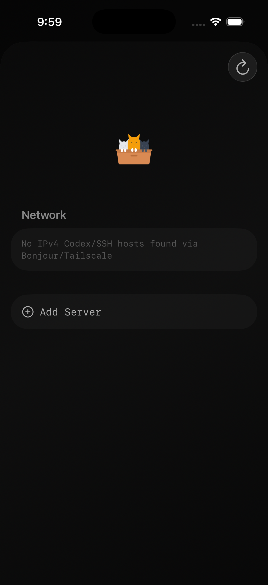
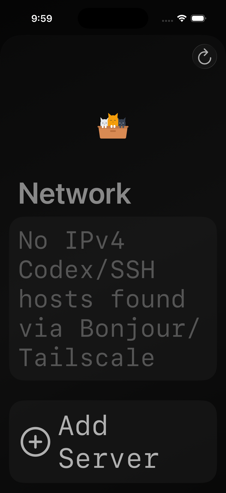

# iPhone 17 Pro Simulator Screenshots

Captured from project `/Users/eagleone/Documents/projects/litter/repo/apps/ios` on simulator `iPhone 17 Pro (iOS 26.2)`.

## 1. Dark (Default)

## 2. Light

## 3. Accessibility XXL Text

## 4. Dark + High Contrast

